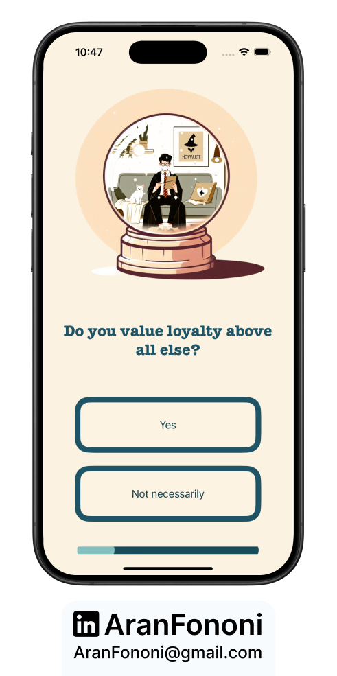
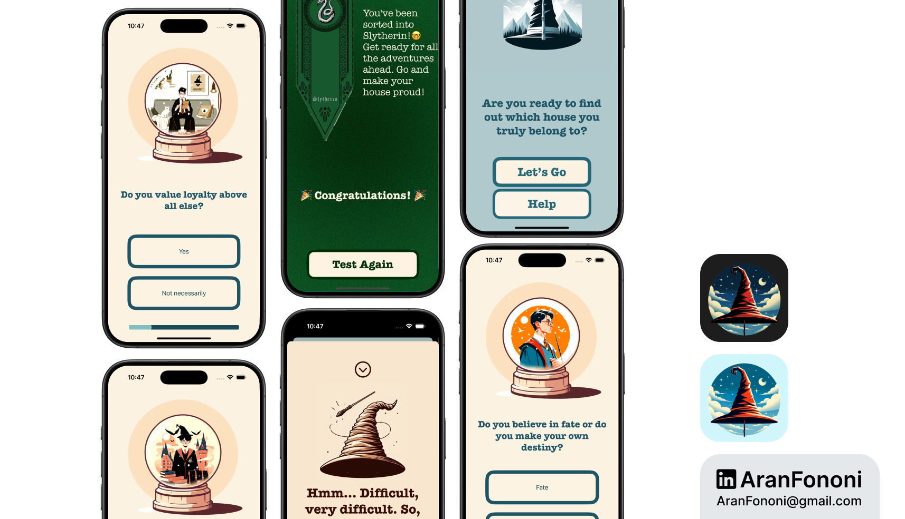

# Hogwarts Sorting

### Personal Project (Independent)

This personal project was developed using knowledge up to Section 11 of the **Complete iOS Development Bootcamp** by Angela Yu. The app determines a user’s Hogwarts house based on a series of personality-based questions, following the MVC architecture and using multiple view controllers.

## Project Overview
The **Hogwarts Sorting** app is designed to assign a user to one of the four Hogwarts houses based on their responses to a series of questions. With dynamic updates and real-time progress tracking, this app calculates personality traits like bravery, ambition, kindness, and more to deliver a final house assignment at the end of the quiz.

## What I Learned
In this project, I focused on:
- **Multiple View Controllers and Segues**: Used segues to transition between view controllers, which include separate screens for questions and results.
- **Custom Model Development**: Created a custom `HogwartsBrain` model to handle question logic, trait tracking, and final house calculation.
- **Progress Tracking**: Implemented a `UIProgressView` to visually track user progress through the quiz.

## Key Skills
- Practical implementation of multi-screen navigation and segues
- Modular design with MVC architecture
- Dynamic data handling in model to view controller interactions

## Additional Features
- Randomized house selection if multiple traits meet the threshold
- Traits and values represented with an enum for streamlined data management and scoring

---

### Project Preview

---

### Footer

---

## Contact
For more information, feel free to reach out:  
- **Email**: [aranfononi@gmail.com](mailto:aranfononi@gmail.com)  
- **LinkedIn**: [Aran Fononi](https://www.linkedin.com/in/aran-fononi-18182b265)
